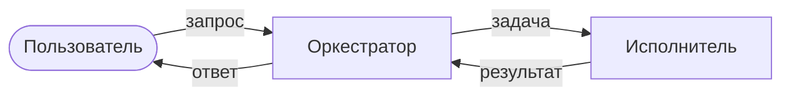

# Схема агентов

> Часть архитектуры. Для одиночного агента или
> обычного сервиса — написать «не применимо» и оставить файл; удалять его
> не нужно, иначе непонятно, решение это или забыли.
>
> Схема рисуется **до** кода: она определяет, кто кого вызывает и где в
> контуре человек. Это структура, а не контракт — сигнатуры живут в коде. Мультиагентные связки — средствами pydantic-ai
> (agent delegation, programmatic hand-off).

## Карта

Каждая стрелка — вызов. Подпись на стрелке — что передаётся.

## Агенты

| Агент | Ответственность | Модель | Инструменты | Кого вызывает |
|---|---|---|---|---|
| | одна фраза, одна зона ответственности | | из таблицы инструментов в [`ARCH.md`](ARCH.md) | |

## Что передаётся между агентами

Только типизированные модели из `backend/domain/models.py` — не свободный
текст. Имена моделей здесь должны совпадать с именами в коде. Для каждой связки: какая модель уходит и какая возвращается.

| Связка | Передаётся | Возвращается |
|---|---|---|

## Человек в контуре

Где выполнение останавливается и ждёт человека, и почему именно там.
Опирается на таблицу границ автономии в [`ARCH.md`](ARCH.md): необратимое действие
без подтверждения не выполняется.

| Точка остановки | Что подтверждает человек | Что будет, если не подтвердил |
|---|---|---|

## Отказы и повторы

Что происходит, если агент не ответил, ответил невалидно или превысил
таймаут. Сколько повторов, и что видит пользователь, когда повторы
кончились.
